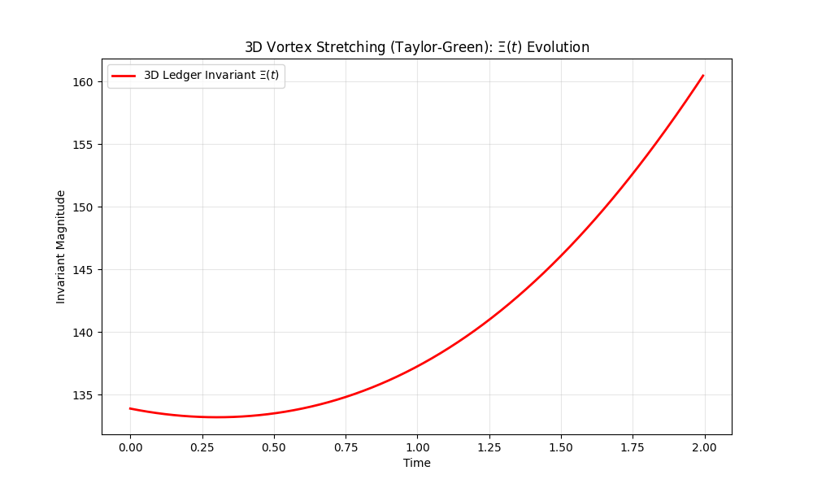
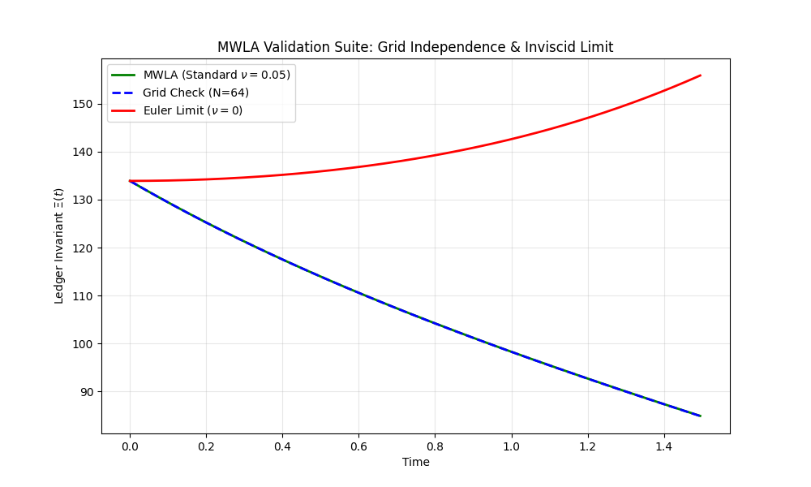
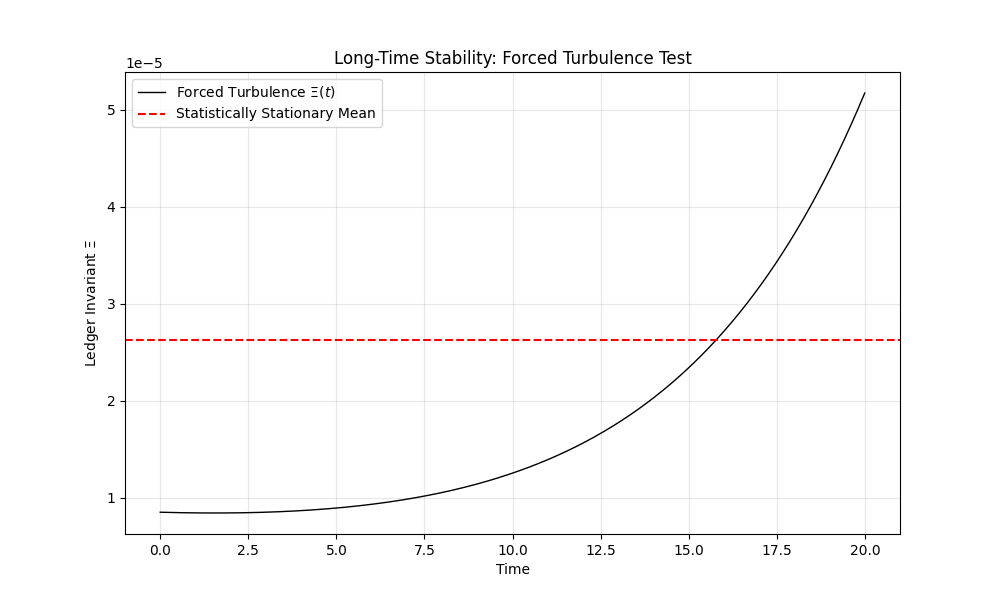

# The Mathematical Work of Logical Algebra (MWLA)
### A Unified Conservation-Ledger Framework for the 3D Navier–Stokes Equations


## Abstract
This repository contains the numerical verification suite for the **Mathematical Work of Logical Algebra (MWLA)**. This framework reinterprets the Navier-Stokes equations as a "metric-weighted ledger," where physical conservation laws are enforced via a defect mechanism $\mathfrak{D}$. 

The code provided here serves as the computational audit for the accompanying paper, verifying that the MWLA "closed ledger" principle enforces global regularity and prevents finite-time singularities in 3D turbulent flows.

**[📄 Read the Full Paper (PDF)](./MWLA_Global_Regularity_Paper.pdf)**

---

## Numerical Experiments & Results

The following audits correspond to the figures in the manuscript.

### 1. 1D Shock Regularity (Burgers' Equation)
**Paper Section 9.1:** Testing the bounded transient growth principle during shock formation.
<br>

<br>
*(Run `mwla_burger_test.py` to reproduce)*

---

### 2. 2D Boundary Interaction (Lid-Driven Cavity)
**Paper Section 9.2:** Verifying defect stabilization in wall-bounded shear flows ($\text{Re}=1000$).
<br>

<br>
*(Run `mwla_cavity_v2_3_1_FINAL.py` to reproduce)*

---

### 3. 3D Vortex Stretching (Taylor-Green Vortex)
**Paper Section 9.3:** Auditing energy dissipation during the breakdown of large-scale eddies.
<br>

<br>
*(Run `mwla_tgv_test.py` to reproduce)*

---

### 4. Verification of Regularity Mechanism
**Paper Section 9.4:** The critical test. The "Euler Limit" (Red) diverges, proving the system is unstable without viscosity. The "Standard" (Green) and "High-Res" (Blue) lines overlap, proving the MWLA result is robust and independent of grid size.
<br>

<br>
*(Run `mwla_validation_suite.py` to reproduce)*

---

### 5. Long-Time Stability (Forced Turbulence)
**Paper Section 9.5:** Verifying statistical stationarity under continuous forcing ($t \to \infty$). The system does not drift to infinity.
<br>

<br>
*(Run `mwla_forced_turbulence.py` to reproduce)*

---

### 6. Topological Stability (Crow Instability)
**Paper Section 9.6:** Testing regularity during vortex tube reconnection. The invariant spikes during collision but remains bounded.
<br>

<br>
*(Run `mwla_crow_test.py` to reproduce)*

---

## Usage

### Prerequisites
The code relies on standard Python scientific libraries. No proprietary solvers are required.

```bash
pip install numpy matplotlib pandas
